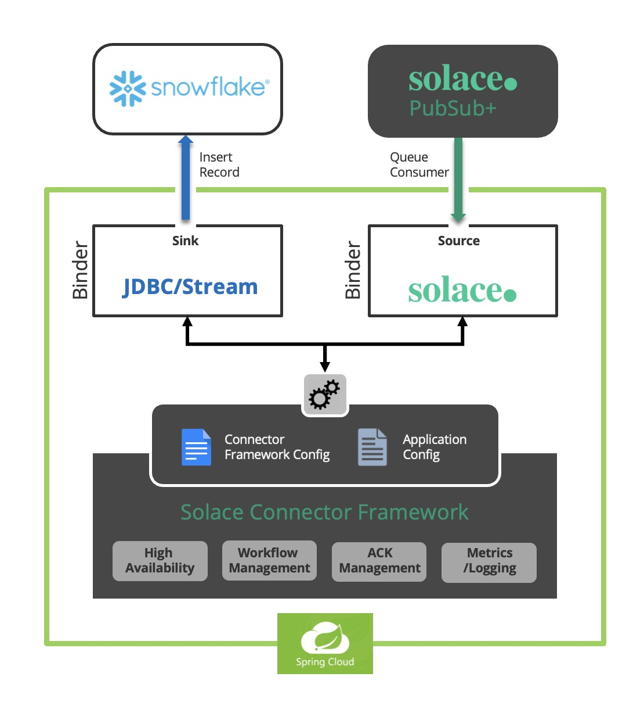
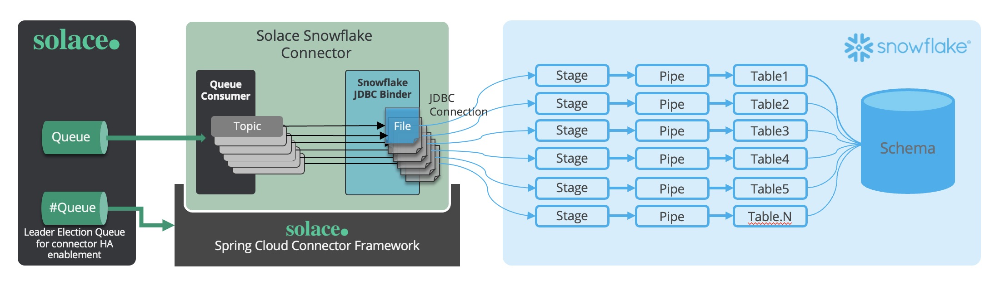
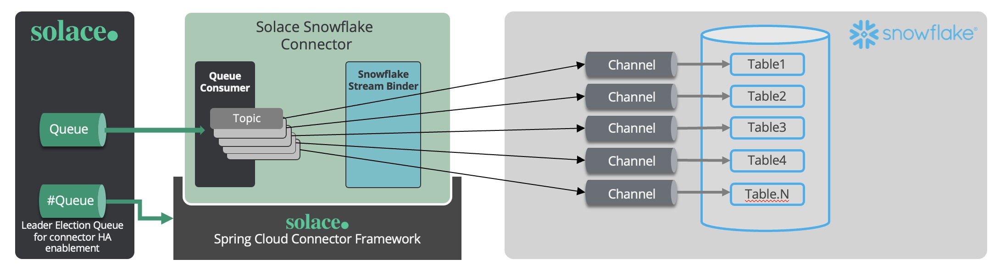

# Solace Pubsub Connector For Snowflake 

 
## 1	Introduction

The **Solace Pubsub Connector For Snowflake** has been built to allow Snowflake to ingest events from the Solace event mesh into tables in your Snowflake data warehouse.

**Solace Pubsub Connector For Snowflake** helps to consume events from Solace Broker or Event Mesh, transform the payload and insert into the Snowflake table as records. 

This is the Architecture of Solace Pubsub Connector For Snowflake.

 
It includes both JDBC/Stream modes, please see the JDBC/Stream architecture:




### 1.1 Purpose

To guide the technical teams to setup the Solace Pubsub Connector For Snowflake.

### 1.2 Scope

Covering the step-by-step guide to setup the Solace Pubsub Connector For Snowflake.

* Configure Snowflake Connector
	* Connection Configuration (Database & Solace)
	* JDBC or Stream configuration
	* Topic to Table Mapping (Solace Event Payload to Table)

`Note: This document currently captures the standalone deployment in Java environment.`

### 1.3	 Snowflake Connector Features


| S.No |	Feature |
| :---: | ---- |
|1	|The connector can consume message from Solace Broker/Solace Event mesh|
|2	|The connector can configured as JDBC mode or Stream to insert the data to Snowflake tables.|
|3	|The connector should have the capability to consume in batch and insert Snowflake table  in batch to avoid chattiness and ensure better performance |
|4	|The connector should support column schema mapping, or just payload and metadata save.|
|5	|When JDBC mode, it can create pipe and stage for each table, cache messages and write to a file on stage in batch.|
|6	|When it is Stream mode, it old support schema mapping|
|7	|Topic to table mapping configurable. |
|8	|Redirect message when the message topic is not mapped to any table.|
|9	|High Available & Fault Tolerance|
|10|	Logging & Syslog|
	


## 2	Connector Configuration

### 2.1	 Pre-requisites
*	JDK 17+
*	Maven 3.9.1
*	Solace PubSub+ Event Broker
*	Snowflake account to access the warehouse and table

### 2.2	Snowflake Configuration


**Cofiguration File**: `projConfig/application.yml`                           

```
snowflake:
  name: JSON_CONNECTOR        #connector name
  redirectOnFailEnable: false #fales,will not redirect,true to redirect the errored message
  redirectPrefix: RD/         #only applicable when redirectOnFailEnable is true, it will add a topic prefix and send the message to a new topic.
  database: TEST              #snowflake database name
  schema: PUBLIC           
  warehouse: COMPUTE_WH
  protocol: https              #https by default
  username: xxxxx              #user name
  port: 443                    #defaul is 443
  account: xxxxxx             
  snHost: your account.ap-south-1.snowflakecomputing.com    #this is a sample snhost
  topicMap: solace/*/cdc/>:ORDERS,solace/json2:TESTTABLE2,zy/jsonERR:ERROR_EXAMPLE           #topic mapping to table
  key: "MIIEvQIBADANBgkqhkiG9w0BAQEFAASCBKcwggSjAgEAAoIBAQDNuM1eOK36Qm2p..."                 


```

* Fill in all the required details of `snowflake` to establish a connection with 
Snowfalke.

* In `topicMap`, please set mapping topic name to table name


* Need to configure above info to connect the Snowflake, need to set private key for in it.

Note to set the public key for the same user in Snowflake:

Just for your reference to generate a set of private and public key :

```
$ openssl genrsa -out rsa_key.pem 2048 
$ openssl rsa -in rsa_key.pem -pubout -out rsa_key.pub
```
```
alter user FADDYW set rsa_public_key='MIIBIjANBgkqhkiG9w0BAQEFAAOCAQ8AMIIBCgKCAQEAzbjNXjit+kJtqTBtZF+B
RNhzLdvrgJw5vCN1Q4tpmi6PQLK6KBnprjUXMbwdrOX9JjIKW2CMpBg+IKfHrYNX
RTL6Rv3yUAWTyJ1AGaCYjfrOGiWxE59Sl2DHmry4bmmiCDmLJ4rvDJzpBNO8552E
M6RGghNFQQIXDUkhxQcYtT0leSqrPzuxl0MMEU3ORrnnbs9rbjaYwB/V2G2AkUJO
UpYxYR2MI9p463OQRDDAfwpkTRfvLe38nalk5Kz0K086AEa+IJvW5DYvbYbfaq0P
P3wQU4a1ZsVBwbd8LAwVzJjMzqOqmuvivxThS88bT2AQTcUBhySuoc5YJx1G6OrN
+QIDAQAB';
```


### 2.3	Solace Configuration

**Configuration File**: `resources/snowflake-sink/application.yml`

Config Solace binder and Snowflake binder.

```
stream:
  bindings:  # Workflow bindings
    input-0:
      destination: q.messages.snowflake   # Queue name as the data source
      binder: solace
      consumer:
        concurrency: 1
        batchMode: true
    output-0:
      destination: lvq/snowflake  # snowflake lvq topic
      binder: solace-snowflake-stream  #solace-snowflake-stream or solace-snowflake-jdbc
      content-type: application/x-java-serialized-object


```


JDBC and Stream configurations:

There are 2 options of configurations, one is for JDBC binder, another is for stream binder.
If it is `solace-snowflake-jdbc`, please use snowflake jdbc config. Otherwise if it is `solace-snowflake-stream`, please use snowflake stream config.


```
# snowflake jdbc config
    schemaMapping: true
    stageNamePattern: TESTSTAGE_{TABLE_NAME}_{CONNECTOR_NAME} # pattern variable : TABLE_NAME, CONNECTOR_NAME ,must contain stage ,case ignored
    pipeNamePattern: TEST_TESTPIPE_{TABLE_NAME}_{CONNECTOR_NAME} # pattern variable : TABLE_NAME, CONNECTOR_NAME, must contain pipe ,case ignored
    bufferEvents: 3
    bufferEventSizeLimit: 10240
    bufferEventWaitTime: 10
    stageCleanFrequency: 120

# snowflake stream config
  role: ACCOUNTADMIN
  onError: continue   #or abort
  ackInterval: 10 
#  topicNodeMap: solace/*/cdc/>:payload.after,


```

Configure the management part for the HA:


```
 management:
   leader-election:
     mode: active_standby  # The connector’s leader election mode. (values: standalone, active_active, active_standby)
     fail-over:
       max-attempts: 3  # The maximum number of attempts to perform a fail-over.
       back-off-initial-interval: 1000  # The initial interval (milliseconds) to back-off when retrying a fail-over.
       back-off-max-interval: 10000  # The maximum interval (milliseconds) to back-off when retrying a fail-over.
       back-off-multiplier: 2.0  # The multiplier to apply to the back-off interval between each retry of a fail-over.
    queue: management-queue-sink  # The management queue name.
    session: # The management session. This has the same interface as that used by `solace.java.*`. For more info: https://github.com/SolaceProducts/solace-spring-boot/tree/master/solace-spring-boot-starters/solace-java-spring-boot-starter#updating-your-application-properties
      host: tcp://IP:PORT
      msgVpn: default
      client-username: user
      client-password: passwd

```


### 2.4	Connector Logging

Logback has been used to enable the logging mechanism. 

**Configuration File**: `resources/logback.xml`

You can change your log default folder in logback.xml:\

```xml
   <property name="LOG_HOME" value="log/push-connector/"/>
```
You can change your log level as showed below:

```xml
<!--DEBUG,INFO,WARN,ERROR,FATAL-->
<root level="INFO">
    <appender-ref ref="STDOUT"/>
    <appender-ref ref="FILE"/>
    <appender-ref ref="RSYSLOG" />
</root>

```
**Configuration File**: `resources/snowflake-config/application.xml`
set logfile:
```xml
  endpoint:
    logfile:
      external-file: log/sink-connector/runtime.log
```

### 2.5	Admin client configuration

Please configure  the admin sever as follows in `application.yml`

```yml
spring:
  boot:
    admin:
      client:
        enabled: true
        url: http://IP:PORT       #configure your admin server url
        auto-registration: true
  application:
    name: Sink(Snowflake)                    #configure your application name

```


## 3	Run Connector

### 3.1 Command line to run the Solace Pubsub Connectors For Snowflake

Go the project 

```
mvn package antrun:run@generate-license-disclosure-stub assembly:single jib:buildTar
```

Go to target folder and run as standalone mode:

```
java -cp ./target/pubsubplus-connector-snowflake-1.0.0-SNAPSHOT.jar --add-opens=java.base/java.nio=ALL-UNNAMED  org.springframework.boot.loader.PropertiesLauncher --spring.config.additional-location="./snowflake-config/" --server.port=8081
```

### 3.2 Command line to run the Solace Pubsub Connectors For Snowflake as HA

Please specify server.port to another value that is not used.

```
java -cp ./target/pubsubplus-connector-snowflake-1.0.0-SNAPSHOT.jar --add-opens=java.base/java.nio=ALL-UNNAMED  org.springframework.boot.loader.PropertiesLauncher --spring.config.additional-location="./snowflake-config/" --server.port=8082
```

Please refer to 1.4.2 Solace Configuration> Configure the management part for the HA.


## 4	Connector Monitoring

Connector monitoring is a Spring Boot Admin server which helps to visualize the connectors deployed in the organization

### 4.1	 Prerequisites
*	Maven 3
*	JDK 17

### 4.2	 Infrastructure Requirement


| Component Name |	Cores	| RAM (GB) |Runtime |
|----|----|----|----|
|Spring Boot Admin |	2 |	4 |	Java |


## 5	Connector Config Parameters

### 5.1	Solace Pubsub Connectors For Snowflake parameters


<table>
    <tr>
        <th>Config Type</th><th>Config Location</th><th>Parameter (Hierarchy)</th><th>Description</th>
    </tr>
    <tr>
        <td rowspan="9">Snowflake-connection</td>
        <td rowspan="9">application.yml</td>
        <td>snowflake.database</td>
        <td rowspan="8">Connection information, get from snowflake</td>
    </tr>
    <tr>
        <td>snowflake.schema</td>
    </tr>
	<tr>
        <td>snowflake.warehouse</td>
    </tr>		
	<tr>
        <td>snowflake.protocol</td>
    </tr>
    <tr>
        <td>snowflake.username</td>
    </tr>
    <tr>
        <td>snowflake.port</td>
    </tr>
    <tr>
        <td>snowflake.account</td>
    </tr>
    <tr>
        <td>snowflake.snhost</td>
    </tr>	
    <tr>
        <td>snowflake.key</td>
        <td>Private key for connector to connect snowflake</td>
    </tr>	
	<tr>
        <td rowspan="1">logging</td>
        <td rowspan="1">logback.xml</td>
        <td>&lt;root level="INFO"&gt;<br/>
    &emsp;&emsp;&lt;appender-ref ref="STDOUT"/&gt;<br/>
    &emsp;&emsp;&lt;appender-ref ref="FILE"/&gt;<br/>
    &emsp;&emsp;&lt;appender-ref ref="RSYSLOG" /&gt;<br/>
    &lt;/root&gt;
		</td>
        <td rowspan="1">used logback to config logging,  it has different levels:
DEBUG,INFO,WARN,ERROR,FATAL</td>
    </tr>
    <tr>
        <td rowspan="14">Connector property</td>
        <td rowspan="14">application.yml</td>
        <td>snowflake.name</td>
        <td rowspan="1">Connector name, will be used when create objects in snowflake.</td>
    </tr>
    <tr>
        <td>snowflake.redirectOnFailEnable</td>
        <td>enable or disable the message redirect to other topic on error</td>
    </tr>
    <tr>
        <td>snowflake.redirectPrefix</td>
        <td>The topic prefix if message was redirected</td>
    </tr>
    <tr>
        <td>snowflake.topicMap</td>
        <td>Mapping the topic name to table name</td>
    </tr>
    <tr>
        <td>snowflake.schemaMapping</td>
        <td>if true, json data will be mapped to table column ;if false, json data will be put into column "RECORD_METADATA", message will be put into column "RECORD_CONTENT"</td>
    </tr>
    <tr>
        <td>snowflake.stageNamePattern</td>
        <td>the pattern of the stageName, {TABLE_NAME} and {CONNECTOR_NAME} will be replace with the specific variable</td>
    </tr>
    <tr>
        <td>snowflake.pipeNamePattern</td>
        <td>the pattern of the pipeName, {TABLE_NAME} and {CONNECTOR_NAME} will be replace with the specific variable</td>
    </tr>
    <tr>
        <td>snowflake.bufferEvents</td>
        <td>The max number of message which the connector holds in buffer</td>
    </tr>
    <tr>
        <td>snowflake.bufferEventSizeLimit</td>
        <td>The max byte size of messages which the connector holds in buffer</td>
    </tr>
    <tr>
        <td>snowflake.bufferEventWaitTime</td>
        <td>The max time before buffer to flush, if buffer not full, in second</td>
    </tr>
    <tr>
        <td>snowflake.stageCleanFrequency</td>
        <td>Interval in seconds the connector check and purge the ingested file</td>
    </tr>
    <tr>
        <td>snowflake.role</td>
        <td>The account role of snowflake</td>
    </tr>
	 <tr>
        <td>snowflake.onError</td>
        <td>continue or abort, the action when error occurred during data insert period, continue or abort and exit</td>
    </tr>
    <tr>
        <td>snowflake.ackInterval</td>
        <td>The interval of check and ack the message, in seconds</td>
    </tr>
	<tr>
        <td rowspan="3">Admin Client</td>
        <td rowspan="3">application.yml</td>
        <td>sping.boot.admin.client.enable:true</td>
        <td>True to enable.</td>
    </tr>
    <tr>
        <td>sping.boot.admin.client.enable:url</td>
        <td>Set the admin server url</td>
    </tr>
    <tr>
        <td>sping.boot.application.name</td>
        <td>Name of the application</td>
    </tr>
	<tr>
        <td rowspan="3">Solace</td>
        <td rowspan="3">application.yml</td>
         <td>sping.cloud.stream.binding.input-0.destination</td>
        <td>Listening queue name</td>
    </tr>
    <tr>
        <td>sping.cloud.stream.binding.output-0.destination</td>
        <td>LVQ topic name</td>
    </tr>
    <tr>
        <td>sping.cloud.stream.binding.output-0.content-type</td>
        <td>Message content typ: plain text is application/x-java-serialized-object </td>
    </tr>

</table>


### 5.2	File Naming Convention

|File Type	|Naming Convention	|Description| Note |
|---|----|----|----|
|Spring Application |	application.yml	| A standard spring boot configuration|	Follow the spring standard yaml notations|
 

